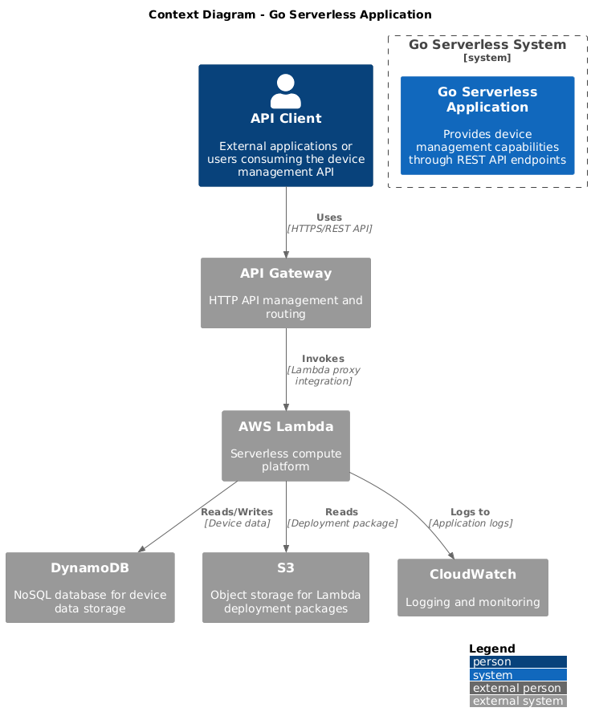
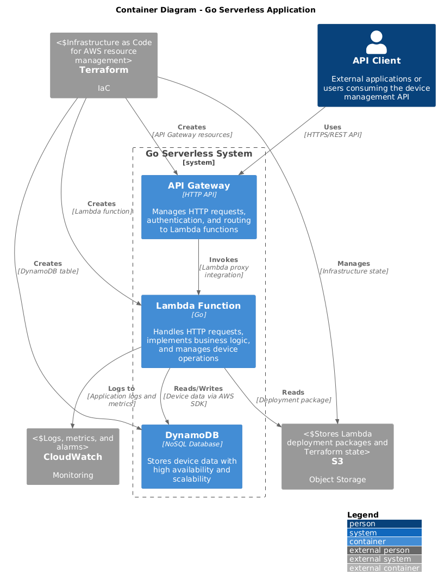
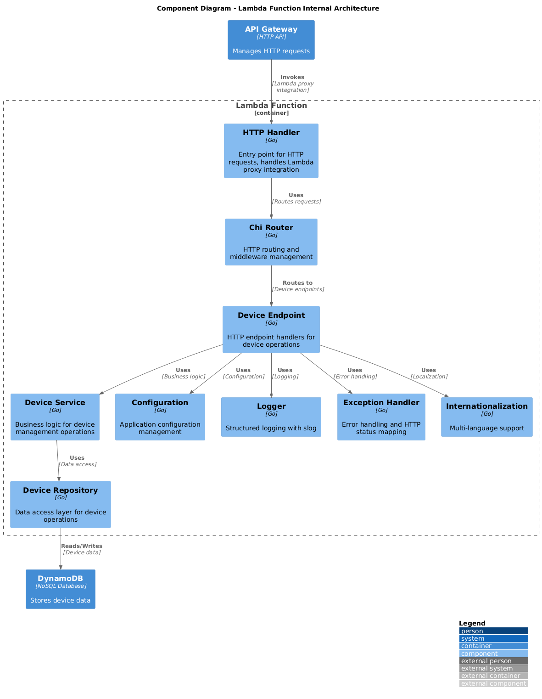
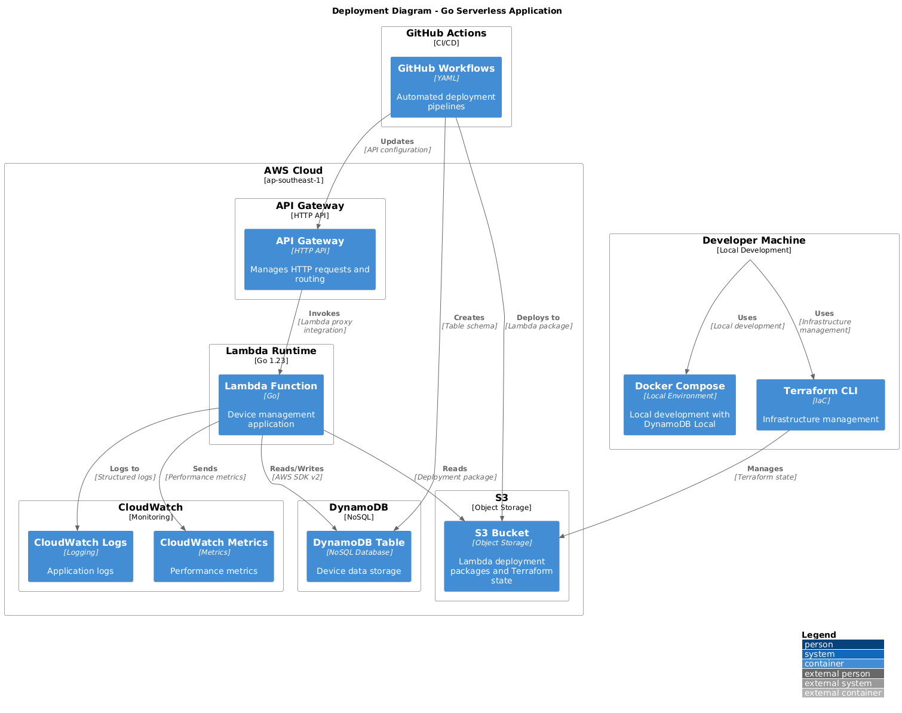
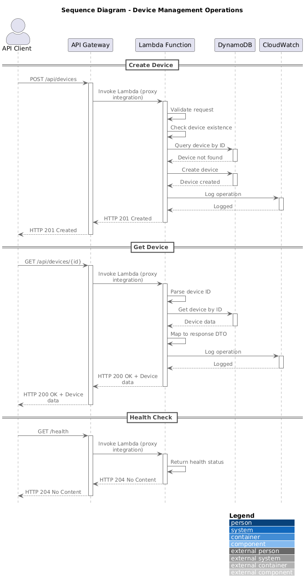

# Go Serverless Application

A modern serverless application built with Go, AWS Lambda, API Gateway, and DynamoDB. This project demonstrates best practices for building scalable, maintainable serverless applications with proper CI/CD pipelines.

# Architecture

## High Level Diagram

## Context Diagram


## Container Diagram


## Component Diagram


## Deployment Diagram


## Sequence Diagram



## Features

- **Serverless Architecture**: Built on AWS Lambda with API Gateway
- **Go Runtime**: Fast, efficient Go application with chi router
- **DynamoDB Integration**: NoSQL database for scalable data storage
- **Infrastructure as Code**: Terraform for infrastructure management
- **CI/CD Pipeline**: Automated deployment with GitHub Actions
- **Local Development**: Docker Compose setup with DynamoDB Local
- **Multi-Environment**: Support for local, development
- **Internationalization**: Multi-language support with locale files
- **Profiling**: Built-in pprof support for performance monitoring
- **Testing**: Comprehensive unit testing (integration test on-progress)

## Project Structure

```
go-serverless/
├── cmd/                          # Application entry points
│   ├── app/                      # HTTP server and Lambda handler
│   └── main.go                   # Main application entry
├── internal/                     # Internal application code
│   ├── app/                      # Application layer
│   │   ├── config/               # Configuration management
│   │   ├── dto/                  # Data Transfer Objects
│   │   ├── endpoint/             # HTTP endpoints
│   │   ├── model/                # Data models
│   │   ├── repository/           # Data access layer
│   │   ├── router/               # HTTP routing
│   │   └── service/              # Business logic
│   └── pkg/                      # Shared packages
│       ├── db/                   # Database connections
│       ├── exception/            # Error handling
│       ├── lang/                 # Internationalization
│       ├── logger/               # Logging utilities
│       └── transport/            # HTTP transport layer
├── terraform/                    # Infrastructure as Code
│   ├── backend/                  # S3 backend configuration
│   ├── environments/             # Environment-specific configs
│   │   ├── development/          # Development environment
│   │   └── local/                # Local development
│   └── modules/                  # Reusable Terraform modules
│       ├── api_gateway/          # API Gateway module
│       ├── dynamodb/             # DynamoDB module
│       └── lambda/               # Lambda function module
├── resources/                    # Application resources
│   └── locales/                  # Internationalization files
├── scripts/                      # Utility scripts
├── .github/                      # GitHub Actions workflows
├── vendor                        # vendorize package (yes, intentionally to fasten development & deployment)
├── Dockerfile                    # Container image for Lambda
├── Dockerfile-builder            # Development container
├── docker-compose.dev.yml        # Local development setup
├── Makefile                      # Build and deployment commands
└── README.md                     # This file
```

## Prerequisites

- **Go 1.23+**: [Download Go](https://golang.org/dl/)
- **Docker & Docker Compose**: [Install Docker](https://docs.docker.com/get-docker/)
- **AWS CLI**: [Install AWS CLI](https://aws.amazon.com/cli/)
- **Terraform**: [Install Terraform](https://www.terraform.io/downloads)
- **Make**: Usually pre-installed on Unix systems

## Quick Start

### 1. Clone the Repository
```bash
git clone https://github.com/your-username/go-serverless.git
cd go-serverless
```

### 2. Set Up Local Environment
```bash

# Start local development environment
make environment

# Run tf local provision
make tf-local-run
```

### 3. Verify Local Setup
```bash
# Check if services are running
docker compose -f docker-compose.dev.yml ps

# Test the health endpoint
curl http://localhost:9000/health
```

## Development

### Local Development
```bash
# Start development environment
make environment

# Build application
make build

# Run tests
make tests-unit

# Run static analysis
make static-analysis
```

### API Endpoints

#### Health Check
```bash
curl http://localhost:9000/health
```

#### Device Management
```bash
# Create a device
curl -X POST http://localhost:9000/api/devices \
  -H "Content-Type: application/json" \
  -d '{
    "name": "Test Device",
    "type": "sensor",
    "location": "office"
  }'

# Get device by ID
curl http://localhost:9000/api/devices/device123
```

### Environment Variables

Create a `.env` file for local development:
```bash
# Application
LOG_LEVEL=debug
TRACING_ENABLED=false
PROFILING_ENABLED=false

# DynamoDB (Local)
DYNAMODB_ENDPOINT=http://dynamodb:8000
DYNAMODB_REGION=ap-southeast-1
DYNAMODB_TABLE_NAME=devices_rizal_alfarizi_local

# Internationalization
LOCALES_BASE_PATH=resources/locales
LOCALES_SUPPORTED_LANGUAGES=en,id,es
```

## Deployment

### Manual Deployment
```bash
# Build and package for Lambda
make make-zip

# Deploy infrastructure
make tf-dev-apply

# Deploy code only
make tf-dev-plan
make tf-dev-apply
```

### CI/CD Pipeline

The project uses GitHub Actions for automated CI/CD:

#### Workflows

1. **Checks** (`.github/workflows/checks.yml`)
   - Runs on every push and PR
   - Static analysis, unit tests

2. **Infrastructure** (`.github/workflows/infra.yml`)
   - Deploys infrastructure changes
   - Triggers on changes to Terraform files and push to main
   - Uses S3 backend for state management

3. **Code Deployment** (`.github/workflows/code.yml`)
   - Deploys application code
   - Updates Lambda function only for fast deployment
   - Triggers on code changes

4. **Development Deployment** (`.github/workflows/deploy-dev.yml`)
   - Manual deployment workflow
   - Allows selective infrastructure/code deployment
   - Uses reusable workflows


### Environment Management

#### Development Environment
- **Region**: ap-southeast-1
- **Lambda**: go-serverless-development
- **DynamoDB**: devices_rizal_alfarizi_development
- **API Gateway**: HTTP API with $default stage

## Testing

### Unit Tests
```bash
make tests-unit
```

### Integration Tests [Currently On Progress]
```bash
make tests-integration
```

### All Tests
```bash
make tests-suite
```


## Monitoring and Logging

### CloudWatch Logs
- Lambda function logs are automatically sent to CloudWatch
- Structured logging with slog
- Log levels: debug, info, warn, error

### Performance Monitoring
- Built-in pprof support for profiling
- Access via `/debug/pprof/*` endpoints (when enabled)
- Memory, CPU, and goroutine profiling

### API Gateway Monitoring
- Request/response metrics
- Error rates and latency
- Integration with CloudWatch

## Security

### IAM Permissions
- Least privilege principle
- Lambda execution role with minimal permissions
- DynamoDB access limited to specific table

### API Security
- CORS configuration
- Input validation
- Error handling without information disclosure

### Infrastructure Security
- S3 bucket encryption
- DynamoDB encryption at rest

## API Documentation

### Base URL
- **Local**: `http://localhost:9000`
- **Development**: `https://adytt253m7.execute-api.ap-southeast-1.amazonaws.com`

### Endpoints
For local you must to invoce function, since we are using aws-lambda locally

### Get Device Local
```
curl --location 'http://localhost:9000/2015-03-31/functions/function/invocations' \
--header 'Content-Type: application/json' \
--header 'Cookie: JSESSIONID=9BCA05F630669297CB83E9E68F461EB6' \
--data '{
  "version": "2.0",
  "routeKey": "GET /api/devices/id2",
  "rawPath": "/api/devices/id2",
  "rawQueryString": "",
  "headers": {
    "Content-Type": "application/json"
  },
  "requestContext": {
    "http": {
      "method": "GET",
      "path": "/api/devices/id2"
    }
  },
  "isBase64Encoded": false
}'
```

### Create Device Local
```
curl --location 'http://localhost:9000/2015-03-31/functions/function/invocations' \
--header 'Content-Type: application/json' \
--header 'Cookie: JSESSIONID=9BCA05F630669297CB83E9E68F461EB6' \
--data '{
    "version": "2.0",
    "routeKey": "POST /api/devices",
    "rawPath": "/api/devices",
    "headers": {
        "Content-Type": "application/json"
    },
    "requestContext": {
        "http": {
            "method": "POST",
            "path": "/api/devices"
        }
    },
    "body": "{\"id\":\"/devices/id1\",\"deviceModel\":\"/devicemodels/id1\",\"name\":\"My Device\",\"note\":\"Test device\",\"serial\":\"SN123456\"}",
    "isBase64Encoded": false
}'
```

### Create Device Cloud
```
curl --location 'https://pp3bliepuc.execute-api.ap-southeast-1.amazonaws.com/api/devices' \
--header 'Content-Type: application/json' \
--data '{
    "id": "/devices/id1",
    "deviceModel": "/devicemodels/id1",
    "name": "Sensor",
    "note": "Testing a sensor.",
    "serial": "A020000102"
}'
```

### Get Device Cloud
```
curl --location --request GET 'https://pp3bliepuc.execute-api.ap-southeast-1.amazonaws.com/api/devices/id1' \
--header 'Content-Type: application/json' \
--data '{
    "id": "/devices/id1",
    "deviceModel": "/devicemodels/id1",
    "name": "Sensor",
    "note": "Testing a sensor.",
    "serial": "A020000102"
}'
```

### Assumptions
- prefix /device/ in creation is a must for device id to make sure it is valid device
- prefix /devicemodels/ in creation is a must for device id to make sure it is valid device
- Partition key for dynamodb is using device id since we need to lookup device based on id